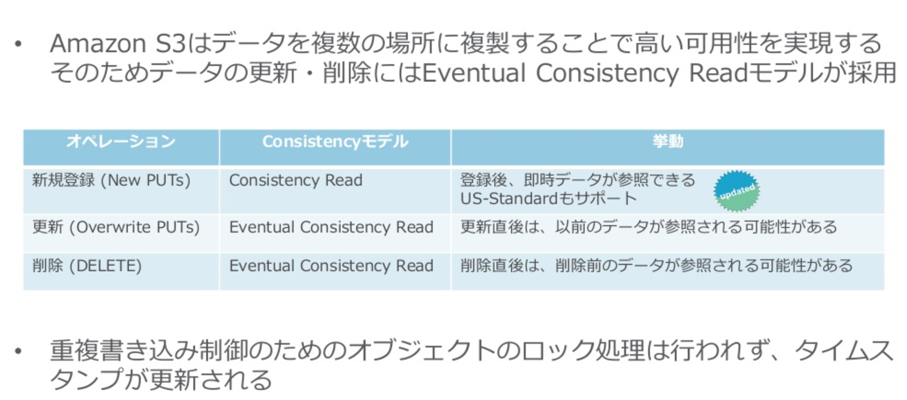
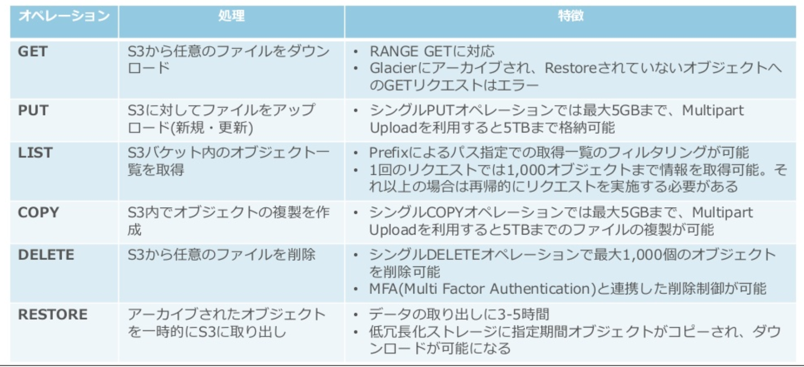

# S3でできること

## オブジェクトストレージとは…？

データをオブジェクト単位で持つストレージのアーキテクチャ

### 特徴

- ブロックストレージに比べて拡張性が高いこと
- 分散ファイルシステム
- 大量のデータの扱いに長けている
- データを**オブジェクト**という単位で扱う
- すべてのオブジェクトは固有のURIを持ち、データへのアクセスはこのURIに対して行う
- インターフェイスはWeb上のコントロールパネルの他に、RESTfull APIが最も使われている
  - この特性上、プログラムやSDKとの親和性が高い
- データに対して直接上書きをするのではなく、新しいデータを書き込み、古いデータを削除するという仕組み
- ディレクトリ構造は持たず、全てフラットな構造
  - これを**バケット**という

### オブジェクトストレージでの可用性

- 分散ファイルシステム
- 1つのオブジェクトを複数のストレージノードに対して書き込む
- そのためRAIDなどの仕組みが不要

### 欠点

- APIの対応が必須
- 部分的な読み書きが出来ないので、データベースや高速I/Oなどのトランザクション処理には向かない

### 用途

- バックアップ
- アーカイブ
- ログの保存
- コンテンツ配信
  - StaticなWeb,画像,動画
- Webサイトホスティング

### 代表的なサービス

#### クラウドサービス

- Amazon Simple Storage Servaice (S3)
- Google Cloud Storage
- Microsoft Azure Storage

#### OSS

- Ceph
- OpenStack Swift
- minio

## Amazon S3について

### S3の特徴

- 業界デファクトスタンダード
  - S3互換オブジェクトストレージなどもある
- 安価かつ高耐久性
  - SLA: 99.999999999%
  - 月1GB/2-4円
- 1オブジェクトあたり最大5TBまで保存可能
- 3箇所のデータセンターで自動複製保存
- AWS上の各種サービスからアクセス可能な中核ストレージサービス

### 様々な機能

- メタデータタグ機能
- ストレージクラス全体のでデータ移動や保存機能
- データアクセスコントロール機能
  - ユーザポリシー  
  IAM Userに対してバケットなどのアクセス権限を設定
  - バケットポリシー  
  S3バケットごとにアクセス権限を設定
  - ACL  
  バケット/オブジェクト単位でのアクセス権限を設定
- アクセス許可の内ユーザからのデータ保護機能
- 大規模分析実行機能
- オブジェクト/バケットレベルモニタリング機能
- VPC Endpoint
  - 同一リージョンのVPCとS3バケット間をNat Gatewayなどを経由せずに接続が可能
- バージョン管理機能
  - オブジェクト更新時に自動的にバージョン管理
  - 保存世代は指定可能

### Eventual Consistency Readモデル

### S3の操作

### 利用できるClient

- AWS Management Console
- AWS SDK
- AWS CLI
- その他サードパーティツール

## LINK

- [オブジェクトストレージ - Wikipedia](https://ja.wikipedia.org/wiki/%E3%82%AA%E3%83%96%E3%82%B8%E3%82%A7%E3%82%AF%E3%83%88%E3%82%B9%E3%83%88%E3%83%AC%E3%83%BC%E3%82%B8)
- [オブジェクトストレージ機能 – Amazon S3](https://aws.amazon.com/jp/s3/features/)
- [AWS再入門 Amazon S3編 ｜ DevelopersIO](https://dev.classmethod.jp/cloud/aws/cm-advent-calendar-2015-aws-re-entering-s3/)
- [AWS Blackbelt 2015シリーズ Amazon Storage Service (S3)](https://www.slideshare.net/AmazonWebServicesJapan/20150422-aws-blackbelts3)
