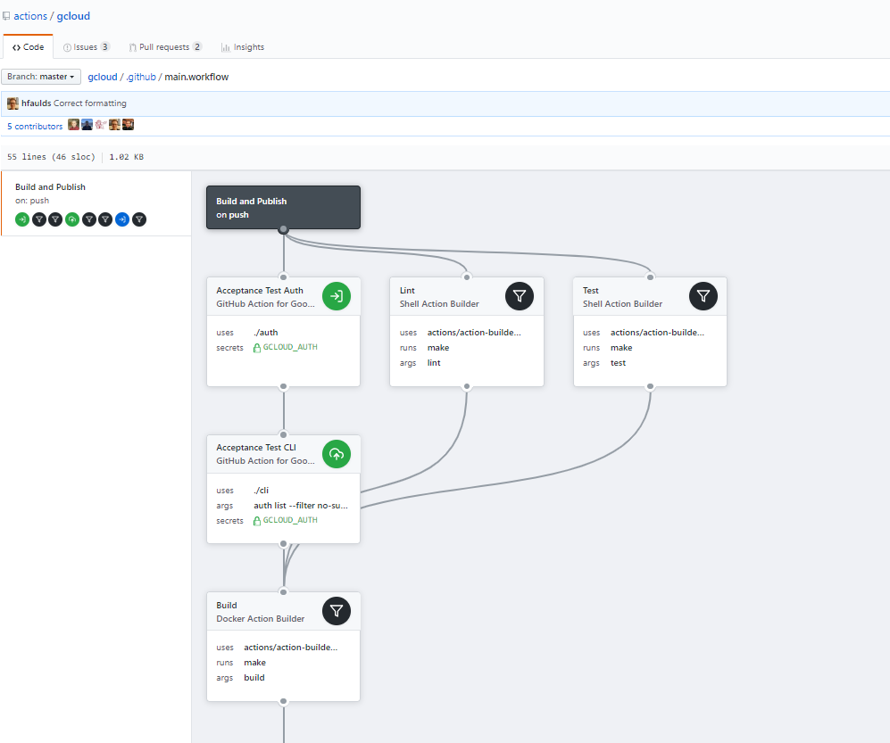

# GitHub Actionsでできること

## Github Actionsとは
- GitHubに埋め込まれたCI/CDツール
- 現在(2019/03/07)時点ではまだベータリリース
  - [Features • GitHub Actions](https://github.com/features/actions)
  - [GitHub Actions | GitHub Developer Guide](https://developer.github.com/actions/)
- GitHub上ですべてを完結させることが可能
- WebGUIでも、`.workflow`ファイルでも設定可能
  ``` sample
    workflow "New workflow" {
        on = "push"
        resolves = ["Hello World"]
    }

    action "Hello World" {
        uses = "./say_hello.sh"
        env = {
            MY_NAME = "KeisukeYamashita"
        }
        args = "\"Hello world, I'm $MY_NAME!\""
    }
  ```
- VisualViewerを使うことで、直感的にフローがわかる！  
   
  - もちろんここでワークフローを作ることも可能（複雑なものはまだ苦手