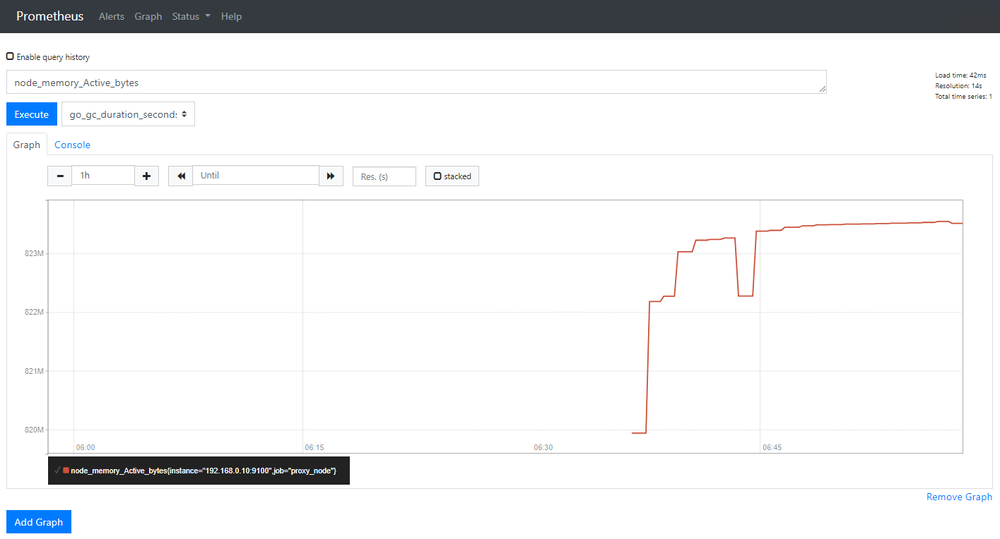

# Prometheusのインストール

Prometheusのインストールには、いくつか種類がある。

- バイナリをダウンロードして起動
- Docker/Docker-Composeで構築
- Kubernetes上に構築

## バイナリをダウンロードして起動

Prometheusはシングルバイナリなので、バイナリをダウンロードして起動すればOKです。最も手軽。

```plan
wget https://github.com/prometheus/prometheus/releases/download/v2.8.0-rc.0/prometheus-2.8.0-rc.0.linux-amd64.tar.gz
tar xzf prometheus-2.8.0-rc.0.linux-amd64.tar.gz
cd prometheus-2.8.0-rc.0.linux-amd64
./prometheus
```

## クライアント側にexporterを入れる

Prometheusサーバからのpull受け口となるexporterを入れます。

### node_exporter

node_exporterはノードのCPUやメモリ値を返します。

[prometheus/node_exporter: Exporter for machine metrics](https://github.com/prometheus/node_exporter)

```paln
$ wget https://github.com/prometheus/node_exporter/releases/download/v0.17.0/node_exporter-0.17.0.linux-amd64.tar.gz
$ tar xzf node_exporter-0.17.0.linux-amd64.tar.gz
$ ./node_exporter
INFO[0000] Starting node_exporter (version=0.17.0, branch=HEAD, revision=f6f6194a436b9a63d0439abc585c76b19a206b21)  source="node_exporter.go:82"
INFO[0000] Build context (go=go1.11.2, user=root@322511e06ced, date=20181130-15:51:33)  source="node_exporter.go:83"
INFO[0000] Enabled collectors:                           source="node_exporter.go:90"
INFO[0000]  - arp                                        source="node_exporter.go:97"
INFO[0000]  - bcache                                     source="node_exporter.go:97"
INFO[0000]  - bonding                                    source="node_exporter.go:97"
INFO[0000]  - conntrack                                  source="node_exporter.go:97"
INFO[0000]  - cpu                                        source="node_exporter.go:97"
INFO[0000]  - diskstats                                  source="node_exporter.go:97"
INFO[0000]  - edac                                       source="node_exporter.go:97"
INFO[0000]  - entropy                                    source="node_exporter.go:97"
INFO[0000]  - filefd                                     source="node_exporter.go:97"
INFO[0000]  - filesystem                                 source="node_exporter.go:97"
INFO[0000]  - hwmon                                      source="node_exporter.go:97"
INFO[0000]  - infiniband                                 source="node_exporter.go:97"
INFO[0000]  - ipvs                                       source="node_exporter.go:97"
INFO[0000]  - loadavg                                    source="node_exporter.go:97"
INFO[0000]  - mdadm                                      source="node_exporter.go:97"
INFO[0000]  - meminfo                                    source="node_exporter.go:97"
INFO[0000]  - netclass                                   source="node_exporter.go:97"
INFO[0000]  - netdev                                     source="node_exporter.go:97"
INFO[0000]  - netstat                                    source="node_exporter.go:97"
INFO[0000]  - nfs                                        source="node_exporter.go:97"
INFO[0000]  - nfsd                                       source="node_exporter.go:97"
INFO[0000]  - sockstat                                   source="node_exporter.go:97"
INFO[0000]  - stat                                       source="node_exporter.go:97"
INFO[0000]  - textfile                                   source="node_exporter.go:97"
INFO[0000]  - time                                       source="node_exporter.go:97"
INFO[0000]  - timex                                      source="node_exporter.go:97"
INFO[0000]  - uname                                      source="node_exporter.go:97"
INFO[0000]  - vmstat                                     source="node_exporter.go:97"
INFO[0000]  - xfs                                        source="node_exporter.go:97"
INFO[0000]  - zfs                                        source="node_exporter.go:97"
INFO[0000] Listening on :9100                            source="node_exporter.go:111"
```

## マニフェストファイルを書く

初期状態のPrometheusは、バイナリ直下の`prometheus.yml`から設定内容を見に行きます。なので、この`prometheus.yml`をかいてみます。

なお、読み込み先のファイルを変更したい場合は、起動時に`--config.file=pm.yaml`のように指定する。

```yaml:prometheus.yml
scrape_configs:                                                                                           │level=info ts=2019-03-11T06:36:12.178568084Z caller=main.go:719 msg="Loading configuration file" filename=
  - job_name: 'prometheus_server'                                                                         │prometheus.yml
    static_configs:                                                                                       │level=info ts=2019-03-11T06:36:12.178988045Z caller=main.go:746 msg="Completed loading of configuration fi
      - targets: ['localhost:9090']                                                                       │le" filename=prometheus.yml
  - job_name: 'proxy_node'                                                                                │level=info ts=2019-03-11T06:36:12.179008146Z caller=main.go:604 msg="Server is ready to receive web reques
    static_configs:                                                                                       │ts."
      - targets: ['192.168.0.10:9100']
```

### scrape_configs

監視設定を書く。この中に書かれた監視対象に対して、Prometheusがpullしてきてメトリックを取得してくる。

[Configuration | Prometheus](https://prometheus.io/docs/prometheus/latest/configuration/configuration/#scrape_config)

#### job_name

その名の通り。各ジョブごとに任意の名前をつけます。

#### static_config

監視対象を定義します。

##### targets

監視対象のIPアドレスもしくはDNS名を登録します。

```yaml
static_configs:
    - target: ['localhost:9090']
```

もしくは

```yaml
static_configs:
    - targets:
        - 'server1:8080'
        - 'server2:8080'
        - 'server3:8080'
```

のように書くことが出来ます。

マニフェストファイルを書き超えたら、一旦起動していたバイナリをCtrl + Cで停止します。その後、再度`./prometheus`することで、`prometheus.yml`が読み込まれます。

読み込まれたら適当なクエリを投げて、次のように正しくNodeから値を取得できていることが確認できます。

